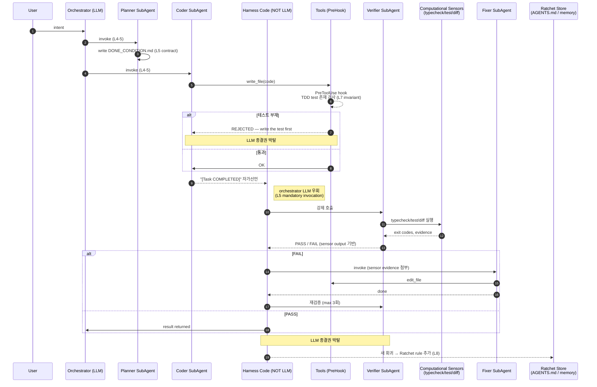

# Coding Agent Harness — 6편 통합 인사이트

**날짜**: 2026-04-26
**계기**: v21 회귀 — coder 가 파일 0개 작성 + `update_todo(completed)` 호출, reviewer/verifier 0회 호출, TDD 무시. 20/20 task "완료" 마킹 vs 실제 8개 파일.
**목적**: harness 의 *역할* 을 prompt 의존 → 결정론적 enforcement 로 재정의.
**결론**: v22 = 기존 hook 시스템 확장으로 #2/#3/#4 ax repo 즉시 패치, v23 = minyoung-mah 0.2.0 으로 #1/#5 추출.

> **2026-04-27 갱신**: Web Claude (민지) 의 리뷰 — *first-principles 정당화 부재* 지적 — 를 받아 §0~§4 로 multi-agent harness 의 1줄 정의 + 8-layer derivation + 처방 layer 매핑 + 3-system 매핑 prepend. 기존 §0~§11 은 §5~§16 으로 재번호.

---

## 0. Multi Agent Harness 의 1줄 정의

> **Multi Agent Harness 란, LLM 의 self-eval bias 를 architectural separation 으로 무력화하면서, 그 분리가 야기하는 조정 비용을 mechanical invariant 와 contract 로 통제하는 시스템.**

이 한 줄이 6편의 공통분모. agent 수 자체가 본질이 아니라 **종결권의 위치** 와 **검증의 위치** 가 본질. Single agent 에선 LLM 이 종결을 선언하고 같은 LLM 이 검증함 (= self-eval).

Multi agent harness 의 첫 번째 존재 이유는 그 둘을 *물리적으로 분리* 하는 것 — Osmani "GANs for prose" 의 재진술이고, v21 이 정확히 이것을 입증한 사례.

부하 분산이나 병렬성은 부수효과. Raschka 가 그 관점에서 SubAgent 를 다뤘지만 (§9 비교표에서도) 반면교사.

---

## 1. First-Principles: 8-Layer Derivation

가장 작은 primitive 부터 시작해 *왜 다음 layer 가 필요한가* 를 강제 도출. 한 layer 가 빠지면 어디서 깨지는지가 정당화.

### Layer 0 — Model
stateless function. text → text. 교체 가능 영역. **Co-training overfitting** (Osmani) 을 인정하면서도 harness 코드는 model swap 에 깨지면 안 됨.
> *stateless 라 turn 넘어가면 다 사라짐 → 따라서:*

### Layer 1 — State
filesystem (durable, LangChain), todo store (task progression 외부 표현), context manager (prompt cache 1급, Raschka — stable prefix 와 변동부 물리적 분리). 캐시 히트율이 비용/지연/일관성에 직접 영향.
> *상태는 있는데 외부 effect 못 줌 → 따라서:*

### Layer 2 — Tools
bounded surface. **Raschka 4-stage gate**: registry → schema → approval → sandbox. bash 가 escape hatch (LangChain). Tool 추가 = 신뢰 텍스트 추가 (Osmani 의 MCP 보안 경고: tool description 이 system prompt 에 stamp 됨).
> *한 단계는 되는데 multi-step autonomous 가 안 됨 → 따라서:*

### Layer 3 — Loop
ReAct. **여기까지가 single agent harness.**
> *단일 LLM 에 모든 역할 주면 (a) self-eval bias 로 거짓 완료, (b) context bloat 로 일관성 손실, (c) prompt 스파게티화 → 따라서:*

### Layer 4 — Agent Topology
orchestrator + specialists. **SubAgent 의 진짜 동기는 품질** (context firewall + generator/evaluator 분리). **Bounded sub-agent** (Raschka): depth limit, read-only 옵션, 도구 권한 명시.

예: verifier 에서 `write_file` 을 *물리적으로 미부여* — 검증자가 코드 못 고치게 만드는 게 prompt 가 아니라 **tool registry**.
> *agent 는 있는데 누가 누구를 언제 부르고 뭘 넘기는지 미정 → 따라서:*

### Layer 5 — Coordination Protocol
세 가지가 코드에 박혀야 함:

1. **Invocation rules** — orchestrator LLM 의 prompt 가 아니라 *task_tool 코드* ("coder 종료 후 verifier 강제 호출")
2. **Context inheritance** — sub-agent 에 무엇이 넘어가는가. 너무 적으면 컨텍스트 부재, 너무 많으면 firewall 무의미
3. **Done-condition contract** — 코드 *전* 에 합의 (Osmani Sprint Contract). DONE_CONDITION.md = framework 선택 + 기대 파일 + 통과 명령. drift 의 가장 큰 원천 차단

> *protocol 은 있는데 "정말 done 인지" 어떻게 아나 → 따라서:*

### Layer 6 — Sensors
**Fowler 2축 분류**:

| | **Computational** (deterministic, cheap) | **Inferential** (LLM-judge, probabilistic) |
|---|---|---|
| **Feedforward** (guide) | DONE_CONDITION.md, AGENTS.md, schema | planner 의 task decomposition |
| **Feedback** (sensor) | typecheck, lint, test, file existence, git diff | critic / verifier SubAgent |

**원칙**: Computational 을 *매 변경마다*, Inferential 은 *선택적*. Inferential 단독은 또 다른 GAN 평가절상 — verifier 가 LLM 이면 그 verifier 도 self-eval bias 가짐. 따라서 verifier 도 computational sensor 출력을 *입력으로 받아야* 함. 이게 HumanLayer hook+exit2 가 순수 inferential 보다 강력한 이유.

> *sensor 결과로 누가 종결 선언? → 따라서:*

### Layer 7 — Termination Control
**LLM 에게 종결권을 주지 않음** 이 핵심 원칙.

- `update_todo(completed)` 같은 자가선언은 *evidence (git diff + file existence + test pass)* 와 교차검증 안 되면 reject
- HumanLayer hook + exit 2 = harness 가 LLM 의 "끝났다" 를 거부하고 강제 재호출
- OpenAI mechanical invariant = lint/structural test 미통과 PR 은 merge 자체 불가

§13 의 6번째 책임 *"Artifact Verification"* 이 정확히 이 layer 에 매핑. 우리 메모리의 *"결과물 형식 강제 X"* 원칙은 *형식 차원* 에 한정되고, *증거* 는 다른 축이라 mechanical 강제 대상 — 이 분리가 v22 의 핵심 통찰.

> *마지막. 같은 실패의 반복을 어떻게 막나 → 따라서:*

### Layer 8 — Learning
**Osmani Ratchet 원칙**. every mistake → permanent rule. AGENTS.md 의 모든 줄은 *과거 실패에 추적가능* 해야 함.

단, **최소 topology (Layer 4-5) 는 선설계해야 함** (Fowler) — 다 failure-driven 으로 가면 첫 회귀에서 topology 를 만드는 비용 발생. **하이브리드**: topology 는 선설계, 룰은 failure-driven.

---

## 2. 흐름 한 장 — LLM 이 종결권 못 가지는 두 지점



**핵심**: LLM 이 두 군데에서 종결권을 못 가짐:
1. **coder 자가선언** → harness 가 verifier 강제 호출
2. **verifier 자가선언** → computational sensor 결과와 교차검증

---

## 3. v22 처방 5개 → 8-Layer 매핑

| 처방 | 매핑 Layer | 결핍의 본질 |
|---|---|---|
| **#1** `update_todo` evidence invariant | **L7 + L8** | LLM 종결권 박탈 부재 |
| **#2** Evaluator 별도 SubAgent + 호출 강제 | **L4 + L5** | mandatory invocation 부재 |
| **#3** Done-condition file | **L5 + L6 (feedforward)** | Sprint contract 부재 |
| **#4** TDD pre-tool-use hook | **L6 (computational feedback) + L7** | mechanical invariant 부재 |
| **#5** Empty-diff session-end invariant | **L7** | self-eval 에 종결 위임 |

처방 5개가 *임의가 아니라* 8 layer 중 4-7 번에 집중된 결핍에 대한 patch 임이 드러남. Layer 0-3 는 ax 에 이미 갖춰져 있고 (model + state + tools + loop), Layer 8 (learning) 은 ratchet 첫 적용으로 #1·#5 가 함께 건드림.

이게 **v22 ax / v23 minyoung-mah phasing 결정의 본질** — 임의의 phasing 이 아니라 *layer 별 결핍 위치에 따른* phasing. 보고서에 "왜 v22 가 ax 이고 v23 이 라이브러리냐" 질문이 들어오면 이 매핑으로 답하면 끝.

---

## 4. ax / minyoung-mah / Prime Jennie 3-System 매핑

| Layer | ax 위치 | minyoung-mah 잔류 | Prime Jennie Runtime 적용 |
|---|---|---|---|
| **0. Model** | dashscope client | (호출자 결정, 라이브러리 비관여) | dashscope (Scout LLM) |
| **1. State** | working_dir, TodoStore | ContextManager, MessageWindowMiddleware | position sheet, Stage policy state |
| **2. Tools** | file_ops, task_tool | tool registry + ToolPermissionManager | screening_executor (격리 샌드박스), backtest engine |
| **3. Loop** | Orchestrator ReAct | Orchestrator engine | slow_loop (macro/scout), fast_loop |
| **4. Topology** | task_tool dispatch | sub-agent abstraction | Scout / Macro / Strategy SubAgent (consumer extension) |
| **5. Coordination** | DONE_CONDITION (v22), planner skill | sub-agent contract API | Scout 코드 generation contract + 시트 발행 protocol |
| **6. Sensors** | sufficiency.gate, verifier | (코딩 도메인 특화 → ax 잔류) | backtest 결과 (PnL, Sharpe, MDD) + Eval Analyst |
| **7. Termination** | `_check_write_policy`, `_AUTO_VERIFY_FAILED` | HookManager + exit-code semantics | **격리 샌드박스 실행 + 최대 3회 자가 교정 + 실패 시 시트 미발행** (`pj.scout.escalate`) |
| **8. Learning** | AGENTS.md (per-project) | ratchet rule store + Orchestrator hook | **Stage 0~3 권한 자동 승격** (Shadow / Scout 코드 / Eval 로직 / Executor 매매). 단 Ratchet 룰 누적은 Phase 3 계획 |

### 핵심 통찰

**Prime Jennie 의 4단계 권한 확장 = Layer 7-8 메커니즘의 도메인 적용**:

- **Stage 0 Shadow** (PR 생성만): Layer 7 의 *자가선언 거부* 가 가장 강한 형태 — runtime repo 에 write 권한 자체 없음 (GitHub token scope 물리적 제한)
- **Stage 1 Scout 코드 자동 merge**: 백테스트 통과 시 (computational sensor — Layer 6) 자동 → 14 일 내 revoke 가능 (Layer 8 학습)
- **Stage 2 Eval 로직 자동 merge**: 8 주 통계 유의성 + auto-merged PR 평균 alpha > 0 (computational + meta inferential 결합)
- **Stage 3 Executor 매매**: **영구 수동** — 자동화 경로 *없음*. Layer 7 의 가장 보수적 형태, Layer 8 학습 비활성

**minyoung-mah 0.2.0 의 HookManager 가 Prime Jennie 로 흘러가는 경로**: 직접 HookManager 사용은 아니고 *consumer extension 패턴*. Prime Jennie 는 minyoung-mah 의 `SubAgentRole` (Scout / Macro / Strategy) + `ToolAdapter` (Screening / Backtest) + Observer 이벤트 (`pj.scout.code_generated` 등) 를 활용하며, Stage policy 자체는 Prime Jennie 도메인에 잔류.

영석님이 그리시던 4단계 권한 확장이 이 8 layer 위에서 **Layer 7-8 메커니즘의 도메인 적용** 으로 자연스럽게 떨어짐:
- AX harness = *코드 생성 도메인* 의 L7-L8
- Prime Jennie = *주식 매매 도메인* 의 L7-L8
- 둘 다 minyoung-mah 의 같은 추상 (Orchestrator, SubAgentRole, ToolAdapter, Observer) 을 *consumer extension* 으로 활용

> **검증 출처**: `/home/youngs75/projects/prime-jennie-runtime/` — `prime_jennie_v3_phase0_design.md` §7.3-7.4, `POSITION_SHEET_SPEC.md` §5.2, `SCOUT_CODE_GENERATION.md` §7, `README.md` §1.2, `PHASE_2_13_COMPLETE.md` §5.1.

---

## 5. TL;DR — 6편 한 문장 요약

| 글 | 한 줄 요약 |
|---|---|
| LangChain (Trivedy) | "Agent = Model + Harness". 일반론적 분류학. verification = self-eval **또는** hook (OR 모델) |
| OpenAI Codex | "Humans steer, agents execute". invariants 를 *mechanical* 강제. self-eval 단독 불충분 (AND 모델) |
| HumanLayer (Kyle) | hook + exit code 2 로 LLM 의 "끝났음" 종결권 박탈. failure-driven scaffolding |
| Fowler (Böckeler) | Guides(feedforward) vs Sensors(feedback), Computational vs Inferential 의 2축 분류 |
| Osmani | **Ratchet** (every mistake → permanent rule), **GANs for prose** (self-eval = 평가절상) |
| Raschka | 6 components 분해 + prompt cache 1급 + 4단 tool gate |

---

## 6. 6편 *수렴* 합의 (전원 동의 — 토론 종결)

| # | 합의 내용 | 우리 적용 |
|---|---|---|
| 1 | **Agent = Model + Harness**, 대부분 leverage 는 harness 측 | ax = harness, qwen3-* = model. harness 진화에 집중 |
| 2 | **Hook 기반 결정론적 enforcement** > prompt 부탁 | 기존 `_check_write_policy`, `_on_end`, `_format_result` 패턴 확장 |
| 3 | **Filesystem = durable state 1차 primitive** | 이미 채택 (TodoStore, working_directory, AGENTS.md) |
| 4 | **AGENTS.md 류 = continual learning 진입점** | 이미 채택 (사용자 메모리 + 프로젝트 AGENTS.md) |
| 5 | **Self-evaluation 단독으론 불충분** | **v22 의 직접 동기** — orchestrator LLM 의 verifier 호출 의존 폐기 |

---

## 7. 6편 *갈림길* (= 우리 결정 포인트)

### 7.1. Self-evaluation 가능한가?

| 입장 | 근거 | 채택 여부 |
|---|---|---|
| **Anthropic / Osmani**: ❌ 불가 ("GANs for prose") | "agents reliably skew positive when grading their own work" | ✅ **채택** (v21 데이터로 입증됨) |
| **HumanLayer**: △ hook + 외부 신호 | self-점검은 외부 게이트 통과시만 신뢰 | ✅ 보완책으로 활용 |
| **Codex (OpenAI)**: △ AND | deterministic + self-eval 둘 다 | ✅ 합쳐서 채택 |
| **Raschka**: ⊘ 입장 없음 | 6 컴포넌트에 evaluator 부재 — *약점* | (반면 교사) |

**결정**: generator (coder) 와 evaluator (verifier) 를 *별도 SubAgent + 강제 호출*. orchestrator LLM 에게 호출 결정권을 주지 않음.

### 7.2. SubAgent 의 동기는?

| 입장 | 의미 | 우리 채택 |
|---|---|---|
| Anthropic / Osmani / HumanLayer | **품질** (context firewall, generator/evaluator GAN) | ✅ |
| Raschka | **부하** (parallel side questions) | (보조) |
| Fowler | 둘 다 가능한 topology | (메타) |

**결정**: 품질 모델 채택 — coder 후 verifier *반드시* 호출.

### 7.3. 시작 전략

| 입장 | 의미 |
|---|---|
| HumanLayer | "start simple, add on actual failure" — failure-driven |
| Fowler | "guides + sensors 균형, 둘 중 하나만은 실패" — topology 선설계 |

**결정**: **하이브리드** — Fowler 의 *최소 topology* (coder→verifier→fixer 사이클) 는 선설계, 그 외 (prompt 튜닝, 새 invariant 추가) 는 failure-driven (Ratchet).

---

## 8. *새 키워드* (이번에 학습한 개념)

### 8.1. Ratchet 원칙 (Osmani)
> "every mistake becomes a rule"

에이전트 실수를 흘리지 않고 *영구 규칙* 으로 격상. 모든 AGENTS.md 줄은 *과거 실패* 에 추적가능해야 함. "Earn each line."

**우리 첫 적용**: v21 의 "0 파일 + completed=true" → 영구 금지 룰.

### 8.2. GANs for prose (Osmani)
> "agents reliably skew positive when grading their own work. It's GANs for prose."

generator (코드 생성) 와 evaluator (검증) 를 같은 모델/프롬프트로 두면 *평가 절상* 으로 거짓 완료. 둘을 *물리적으로 분리* 한 SubAgent + harness 가 호출 강제 = 우리 v22 #2 의 이론적 근거.

### 8.3. Hook + exit code 2 (HumanLayer)
> "your likelihood of successfully solving a problem with a coding agent is strongly correlated with the agent's ability to verify its own work."

에이전트가 "끝났다" 선언하는 순간 hook 가 typecheck/biome 실행 → 실패 시 stderr + `exit 2` → harness 가 *agent 강제 재호출*. LLM 의 자가선언이 종결권을 갖지 못한다.

**우리 매핑**: `_AUTO_VERIFY_FAILED` 마커 + critic escalate.

### 8.4. Sprint Contract / Done-condition first (Osmani)
> 코드 쓰기 *전에* "done 이 뭔지" 합의. "더 어떤 prompt 변경보다 scope drift 를 많이 잡았다."

**우리 매핑**: v22 #3 의 `DONE_CONDITION.md` — planner 가 코드 *전* 에 framework 선택 + 기대 파일 + 통과 명령 명시.

### 8.5. Co-training overfitting (Osmani)
> 모델은 자기가 학습된 harness 에서 더 잘 작동. `apply_patch` vs `str_replace` 같은 사소한 도구 변경에서 회귀 발생.

**경고**: 우리 패치가 qwen 에서 잘 돌아도 claude 로 옮길 때 회귀 가능. v22 의 패치는 qwen 검증 후 다른 모델로도 검증 필요.

### 8.6. Guides vs Sensors (Fowler)
> "feedback-only = 같은 실수 반복. feed-forward-only = 룰만 있고 결과 모름."

| 축 | 의미 | 우리 매핑 |
|---|---|---|
| **Guides** (feedforward) | task 시작 전 alignment | DONE_CONDITION.md, 사용자 결정사항, planner skill |
| **Sensors** (feedback) | 실행 후 결과 측정 | sufficiency.gate, verifier execute pairs, write_file policy |

### 8.7. Computational vs Inferential (Fowler)
> "computational = deterministic + fast, inferential = expensive + non-deterministic"

| 종류 | 예 | 우리 위치 |
|---|---|---|
| Computational | tests, linters, type checkers, file existence | sufficiency.gate, write_file policy, _verifier_signals_success |
| Inferential | LLM-as-judge, AI code review | critic SubAgent, verifier SubAgent |

전략: **Computational 를 매 변경마다, Inferential 는 선택적**.

### 8.8. Ambient affordances (Fowler)
> "structural properties of the environment itself that make it legible, navigable, and tractable to agents."

강타입 언어, 명확한 모듈 경계, 프레임워크 추상화 — *코드베이스가 harness-able 한가* 가 선결 조건.

**시사점**: 우리가 만들어주는 테스트 대상 프로젝트 (PMS 등) 의 ambient affordance 도 중요. React 선택 = TypeScript + 명확한 컴포넌트 경계 자동 확보.

### 8.9. 4-stage tool gate (Raschka)
모든 tool 호출 전 4단 검증:
1. known tool? (registry 조회)
2. args valid? (pydantic)
3. approval? (user/auto)
4. path inside workspace? (sandbox)

**우리 현황**: 1, 2, 4 는 있음. 3 (approval) 은 ask_tool 로 부분 구현. 향후 보강 가능.

### 8.10. Prompt cache reuse 1급 (Raschka)
"Stable prefix (instructions + tool defs + workspace summary)" + "변동 부분 (recent transcript + memory + new request)" 의 *물리적 분리*. 캐시 히트율이 비용/지연/일관성에 직접 영향.

**우리 현황**: minyoung-mah 의 ContextManager 가 일부 담당. 더 명시적 prompt shape 분리 필요할 수도.

### 8.11. Bounded SubAgent (Raschka)
"how to *spawn* 보다 how to *bind*". depth limit, read-only 옵션, context 상속량 명시.

**시사점**: reviewer = read-only 강제 (write_file/edit_file 도구 미부여) — 안전성 ↑.

---

## 9. 6편 비교표

| 항목 | LangChain | OpenAI | HumanLayer | Fowler | Osmani | Raschka |
|---|---|---|---|---|---|---|
| Verification 모델 | OR | AND | hook+exit2 | comp+inf | generator≠evaluator | (없음) |
| 거짓 완료 차단 | 약 | 강 (mechanical) | 강 (hook) | 중 (한계 시인) | 강 (GAN) | 약 |
| TDD 강제 | self-eval 옵션 | invariants | hook 사이클 | comp sensor | hook | 없음 |
| Reviewer 호출 | model 결정 | 강제 loop | hook | topology | 분리 강제 | 옵션 |
| Subagent 동기 | 일반론 | 책임 분리 | context firewall | topology | 품질 분리 | 부하 분리 |
| 시작 전략 | 일반론 | 운영 | failure-driven | guides+sensors | failure+ratchet | components |

---

## 10. v21 사례 → 6편 진단

```
fact: coder 가 파일 0개 작성 + update_todo(completed)
     reviewer/verifier 0회 호출
     20/20 "완료" vs 실제 8개 파일 (Vue, React 선택했음)
```

| 6편 진단 | 우리 처방 |
|---|---|
| OpenAI: "invariants mechanical 부재" | update_todo evidence invariant (v23) |
| HumanLayer: "exit 2 hook 부재" | _AUTO_VERIFY_FAILED 마커 + escalate |
| Osmani: "GANs for prose — self-eval 의존" | auto-chain verifier (v22 #2) |
| Osmani: "Sprint Contract 부재" | DONE_CONDITION.md (v22 #3) |
| Fowler: "Computational sensor 부재" | sufficiency 의 forbidden_patterns 검사 (v22 #3) |
| Fowler: "Topology 변량 축소 부재" | 명시적 coder→verifier→fixer LangGraph topology (v22 #2 in task_tool) |
| Raschka: "4단 gate 의 #3 (approval) 약함" | (deferred) |
| LangChain (반면): "OR 모델 = 우리가 따라온 길" | AND 로 전환 |

---

## 11. v22 처방 5가지 (6편 합의 기반)

| # | 처방 | 6편 지지 | 위치 | 비고 |
|---|---|---|---|---|
| 1 | `update_todo(completed)` 의 mechanical invariant (git diff + evidence 없으면 reject) | 6/6 | minyoung-mah 0.2.0 | v23 |
| 2 | Evaluator 별도 SubAgent + 호출 강제 (orchestrator LLM 의존 X) | 6/6 | ax/task_tool.py | **v22 ✅ 구현 완료** |
| 3 | Done-condition file (Sprint Contract) — 코드 *전* 에 합의 | Osmani 핵심, Fowler 지지 | ax/sufficiency + planner skill | **v22 ✅ 구현 완료** |
| 4 | TDD = PreToolUse hook (write_file 시점에 test 파일 존재 검사) | HumanLayer + Osmani | ax/file_ops.py | **v22 ✅ 구현 완료** |
| 5 | "파일 0개 + completed" = 세션-종료 invariant (Ratchet 첫 적용) | Osmani + 전원 | minyoung-mah 0.2.0 (orchestrator hook) | v23 |

---

## 12. v22 → v23 단계 분담

| 메커니즘 | v22 (ax repo) | v23 (minyoung-mah 0.2.0) |
|---|---|---|
| Auto-verifier chain (#2) | ✅ task_tool.py `_run_wrapped` 에 transactional 구현 | (검증 후 추출 가능 — 일반화) |
| DONE_CONDITION (#3) | ✅ sufficiency/signals.py + rules.py 확장, planner skill 추가 | (특정 코딩 도메인이라 ax 잔류) |
| TDD pre-hook (#4) | ✅ file_ops.py `_check_write_policy` 확장 | (코딩 도메인 잔류) |
| update_todo evidence invariant (#1) | (보류) | ✅ todo_tool 자체에 invariant — 모든 consumer 혜택 |
| Empty-diff session-end invariant (#5) | (보류) | ✅ Orchestrator hook (Ralph Loop 강화) |

이유: ax/coding 도메인 특화는 ax 에 잔류, 라이브러리화 가능한 범용 패턴은 minyoung-mah 로 추출.

---

## 13. 우리 *6책임* (v22 부터)

기존 5책임:
1. **Safety** — 위험 명령/경로 차단
2. **Detection** — 진전 부재 / 같은 도구 반복 검출
3. **Clarity** — HITL 프롬프트, 사용자 결정사항 명시
4. **Context** — 메모리/skills/working dir 주입
5. **Observation** — 모든 사이클 로깅 + Langfuse

v22 추가:
6. **Artifact Verification** — *결과물의 모양은 강제 X (그대로), 결과물의 존재·증거는 강제 O*. 이 둘은 다른 축이며 v21 까지 우리는 후자를 누락했음.

> 메모리의 *"결과물 형식 강제 X. B형 강제 금지"* 원칙은 *형식* 에 한해 유효. *증거* 는 mechanical 강제 대상.

---

## 14. 결정된 운영 원칙

| 결정 | 채택 | 근거 |
|---|---|---|
| A. Self-eval 비신뢰 | ✅ | v21 + Anthropic |
| B. SubAgent = 품질 분리 (mandatory invocation) | ✅ | 6/6 |
| C. Invariant 위치 매트릭스 | ✅ | 위 v22/v23 분담표 |
| D. Failure = Soft 3회 → Hard escalate | ✅ | HumanLayer + Codex |
| E. Breaking change = minyoung-mah 0.2.0 (semver bump) | ✅ | 라이브러리 영향 인정 |
| F. Phasing v22 ax → v23 라이브러리 | ✅ | failure-driven, 효과 확인 후 추출 |

---

## 15. 향후 (v23 이후) 검토 큐

- Bounded SubAgent (Raschka): reviewer = read-only 강제
- 4-stage tool gate 의 #3 (approval): 자동/사용자 승인 분리
- Prompt cache 1급 (Raschka): Stable prefix vs 변동 분리 명시
- Co-training overfitting 대응: qwen 외 모델 검증 매트릭스
- Topology template (Fowler): 프로젝트 종류별 (web/api/cli) harness 번들
- Prime Jennie Phase 3: Ratchet 룰 누적 메커니즘 (현재 Eval 기반 prompt 진화만)

---

## 16. 출처

| # | 글 | URL |
|---|---|---|
| 1 | LangChain — Anatomy of an Agent Harness (Trivedy) | https://www.langchain.com/blog/the-anatomy-of-an-agent-harness |
| 2 | OpenAI — Harness Engineering (Codex 팀) | https://openai.com/ko-KR/index/harness-engineering/ |
| 3 | HumanLayer — Skill Issue: Harness Engineering for Coding Agents (Kyle) | https://www.humanlayer.dev/blog/skill-issue-harness-engineering-for-coding-agents |
| 4 | Martin Fowler — Harness Engineering (Böckeler) | https://martinfowler.com/articles/harness-engineering.html |
| 5 | Addy Osmani — Agent Harness Engineering | https://addyosmani.com/blog/agent-harness-engineering/ |
| 6 | Sebastian Raschka — Components of A Coding Agent | https://magazine.sebastianraschka.com/p/components-of-a-coding-agent |

**리뷰**: Web Claude (민지), 2026-04-27 — first-principles 정당화 부재 지적. §0~§4 prepend 의 직접 동기.

**검증**:
- 6편 원문: agent 의 web 탐색 (general-purpose subagent)
- Prime Jennie 매핑: `/home/youngs75/projects/prime-jennie-runtime/` Explore agent 직접 확인
