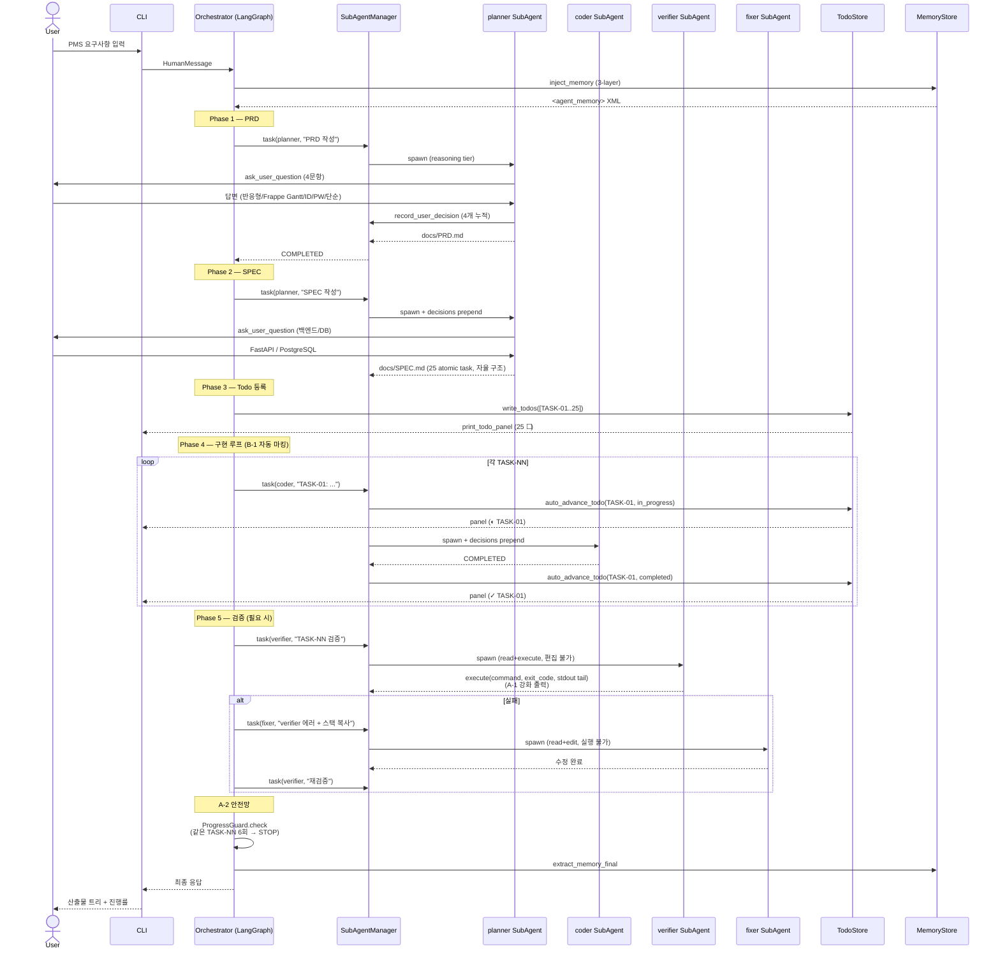
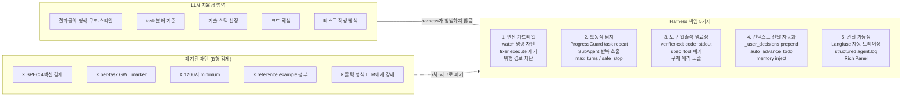
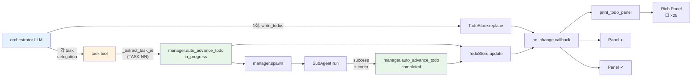
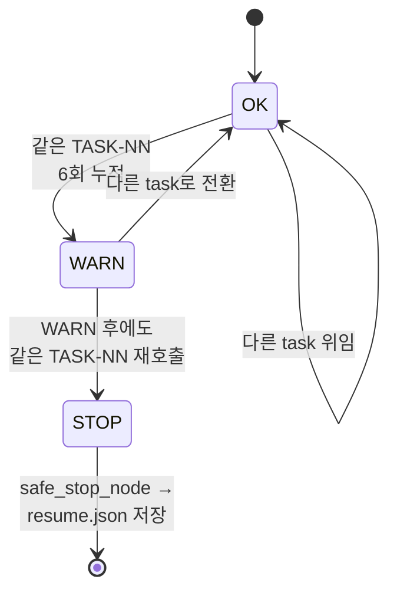
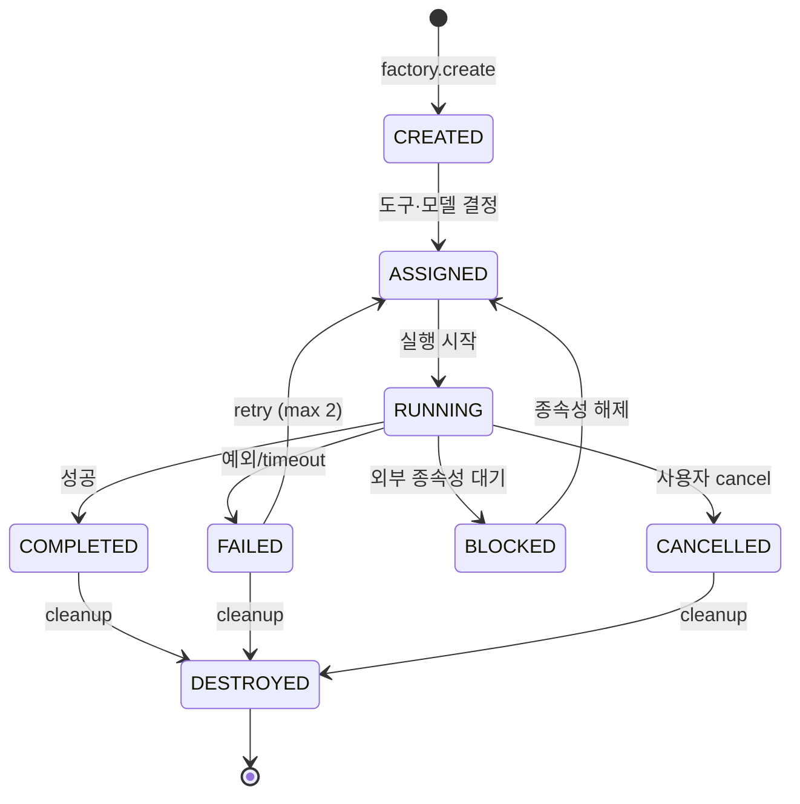
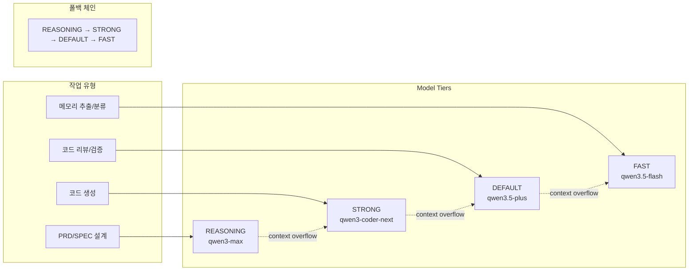
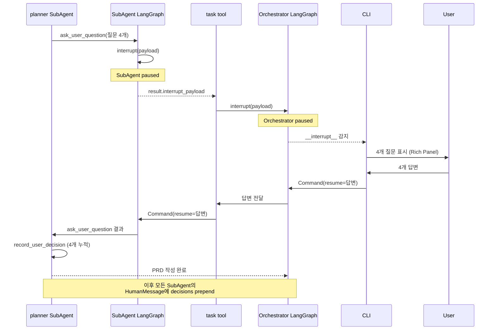

# AX Coding Agent — 시스템 구성도

8차 세션 기준 (Sub-B + Phase 3 A/B/C 패치 반영). 본 문서는 README.md / EVIDENCE.md 의 보조 자료로, 시스템 구성도와 핵심 실행 흐름을 다이어그램으로 정리합니다.

---

## 1. 전체 구성도

```mermaid
flowchart TB
    subgraph CLI["CLI Layer (Rich + prompt-toolkit)"]
        REPL[REPL<br/>슬래시 커맨드]
        Panel[Todo Panel<br/>실시간 진행률]
    end

    subgraph Loop["Orchestrator Loop (LangGraph StateGraph)"]
        IM[inject_memory] --> AG[agent]
        AG --> RA{route_after<br/>_agent}
        RA -- tool calls --> TN[tool node]
        RA -- text only --> EM[extract_memory_final]
        RA -- error --> HE[handle_error]
        RA -- safe stop --> SS[safe_stop]
        TN --> CP[check_progress]
        CP --> AG
        HE --> AG
        EM --> END((END))
        SS --> END
    end

    subgraph OrchTools["Orchestrator Tools (read-only + delegation)"]
        T1[read_file]
        T2[glob_files]
        T3[grep]
        T4[task]
        T5[write_todos]
        T6[update_todo]
    end

    subgraph SubAgents["SubAgent System (factory + manager)"]
        SF[SubAgentFactory<br/>키워드+LLM 분류]
        SM[SubAgentManager<br/>spawn/retry/<br/>_user_decisions/<br/>_todo_store]
        REG[Registry<br/>8-State FSM<br/>이벤트 로그]
    end

    subgraph Roles["6 Role Templates"]
        PL[planner<br/>+ ask_user_question]
        CO[coder<br/>+ write_file/edit/execute]
        VE[verifier<br/>read + execute<br/>편집 불가]
        FI[fixer<br/>read + edit<br/>실행 불가]
        RV[reviewer]
        RS[researcher]
    end

    subgraph Memory["3-Layer Long-term Memory"]
        MS[MemoryStore<br/>SQLite + FTS5]
        MX[MemoryExtractor<br/>LLM 자동 추출]
        MM[MemoryMiddleware<br/>inject/extract]
        L1[user]
        L2[project]
        L3[domain]
    end

    subgraph Resilience["Resilience"]
        WD[Watchdog<br/>asyncio timeout]
        PG[ProgressGuard<br/>action repeat<br/>+ task repeat<br/>A-2]
        SST[SafeStop<br/>max_iter / 위험경로]
        EH[ErrorHandler<br/>retry/fallback/abort]
    end

    subgraph Models["Models (LiteLLM Gateway)"]
        REASON[REASONING<br/>qwen3-max]
        STRONG[STRONG<br/>qwen3-coder-next]
        DEFAULT[DEFAULT<br/>qwen3.5-plus]
        FAST[FAST<br/>qwen3.5-flash]
        LF[Langfuse<br/>자동 트레이싱]
    end

    REPL --> Loop
    Panel <-. callback .- SM
    AG --> OrchTools
    T4 --> SM
    T5 --> SM
    T6 --> SM
    SM --> SF
    SF --> Roles
    SM --> REG
    AG --> MM
    MM --> MS
    MS --> L1
    MS --> L2
    MS --> L3
    MX --> MS
    Loop --> Resilience
    Roles --> Models
    AG --> Models
    Models --> LF
```

---

## 2. 단일 사용자 요청 처리 흐름 (PMS E2E 기준)



---

## 3. Harness의 책임 범위 (8차 세션 정립)



---

## 4. Todo Ledger의 데이터 흐름 (B-1 자동 마킹)



**핵심**: orchestrator LLM은 write_todos를 단 1회만 호출하면 됩니다. 그 이후 모든 진행/완료 마킹은 task 도구가 description의 `TASK-NN` 패턴을 자동 추출해 처리합니다. update_todo의 명시적 호출은 자동 추출이 안 되는 예외 상황(예: planner/researcher 위임)에만 필요합니다.

---

## 5. ProgressGuard A-2: 동일 task 반복 차단



window=12, threshold=6 기본값. verifier↔fixer 사이클이 같은 TASK-NN을 6회 이상 반복 시 한 번 WARN, 또 발생하면 STOP. 7차 이전엔 description-based hashing으로 `verifier "x"` → `verifier "x detail"` 같은 미세 차이를 같은 호출로 못 잡았는데, A-2에서 `_TASK_ID_PATTERN`으로 description의 `TASK-NN` prefix만 추출해 dedupe.

---

## 6. SubAgent 상태 머신 (8-State FSM)



각 전이는 `SubAgentEvent`로 기록되어 `/events` 슬래시 커맨드로 조회 가능.

---

## 7. 4-Tier 모델 정책



전 티어 DashScope 직접 호출 (OpenRouter 경유 시 Qwen3 provider timeout 이슈 회피). 모든 호출은 LiteLLM Gateway를 거쳐 Langfuse에 자동 트레이싱.

---

## 8. HITL 흐름 (LangGraph interrupt 기반)



---

## 9. 디렉토리 구조

```
ax_advanced_coding_ai_agent/
├── coding_agent/                   # 메인 패키지
│   ├── core/                       # 에이전트 루프, 상태, tool adapter
│   │   ├── loop.py                 # LangGraph StateGraph + SYSTEM_PROMPT
│   │   ├── state.py                # AgentState TypedDict
│   │   ├── orchestrator.py         # 라우팅
│   │   ├── tool_adapter.py         # 오픈소스 모델 tool calling 어댑터
│   │   └── tool_call_utils.py      # JSON 복구, 직렬화
│   ├── memory/                     # 3계층 장기 메모리
│   │   ├── schema.py               # MemoryRecord
│   │   ├── store.py                # SQLite + FTS5
│   │   ├── extractor.py            # LLM 자동 추출
│   │   └── middleware.py           # inject/extract
│   ├── subagents/                  # SubAgent 시스템
│   │   ├── models.py               # 8상태 FSM
│   │   ├── registry.py             # 인스턴스 추적, 이벤트 로그
│   │   ├── factory.py              # 역할 템플릿 + 분류
│   │   └── manager.py              # spawn, _user_decisions, _todo_store, auto_advance_todo
│   ├── resilience/                 # 복원력
│   │   ├── watchdog.py             # asyncio timeout
│   │   ├── retry_policy.py         # 7가지 장애 유형 정책
│   │   ├── progress_guard.py       # action repeat + task repeat (A-2)
│   │   ├── safe_stop.py            # max_iter / 위험 경로
│   │   └── error_handler.py        # 통합 에러 처리
│   ├── tools/                      # 도구 시스템
│   │   ├── file_ops.py             # 파일 CRUD + write policy
│   │   ├── shell.py                # P0 shell hardening (watch 차단 + CI=1)
│   │   ├── task_tool.py            # SubAgent 위임 + B-1 자동 todo 마킹
│   │   ├── todo_tool.py            # write_todos / update_todo (TodoStore)
│   │   └── ask_tool.py             # ask_user_question (HITL)
│   ├── cli/
│   │   ├── app.py                  # REPL + 스트리밍
│   │   └── display.py              # Rich Panel + spinner-safe todo 출력
│   └── utils/
│       └── langfuse_trace_exporter.py  # trace 추출 CLI
├── tests/                          # 231개 (8차 기준)
├── docs/
│   └── ARCHITECTURE.md             # 본 문서
├── README.md                       # 프로젝트 개요
├── EVIDENCE.md                     # 요구사항 증빙
├── AGENTS.md                       # AI 에이전트 규칙
├── Dockerfile, docker-compose.yml
├── litellm_config.yaml             # 모델 라우팅
├── ax-agent.sh                     # 실행 스크립트
└── make-submission.sh              # 제출 zip 빌드
```

---

## 10. 8차 세션 핵심 변경 요약

| 영역 | 변경 | 효과 |
|------|------|------|
| `tools/spec_tool.py` | **삭제** | 4섹션 + per-task GWT 강제 폐기. 무한 reject 루프 구조적 제거 |
| `tools/file_ops.py` | SPEC 경로 거부 제거 | LLM이 PRD/SPEC/SDD를 자유롭게 작성 |
| `subagents/factory.py` | planner 프롬프트 슬림화 + HITL 1순위 | 약한 모델의 attention 분산 방지 |
| `tools/todo_tool.py` | 신규 — TodoStore + write/update | orchestrator 진행 상황 ledger |
| `tools/task_tool.py` | `_extract_task_id` + `auto_advance_todo` 호출 (B-1) | LLM이 update_todo 안 호출해도 ledger 자동 동기화 |
| `subagents/manager.py` | `_invoke_graph` verifier 출력 강화 (A-1) | exit code + stdout tail 그대로 노출 |
| `resilience/progress_guard.py` | `_task_history` + `task_repeat_threshold` (A-2) | 동일 TASK-NN 6회 시 WARN, 7회 STOP |
| `cli/display.py` | `print_todo_panel` + spinner-safe | 25 task 진행률 실시간 시각화 |
| `core/loop.py` SYSTEM_PROMPT | 형식 강제 가이드 제거, 자동 마킹 안내 추가 | 사용자 입력의 SPEC 구조 의도 그대로 따름 |

위 변경 후 **231/231 테스트 통과**, **8차 E2E에서 25 atomic task가 자율 작성되고 ledger 자동 진행 검증**.
